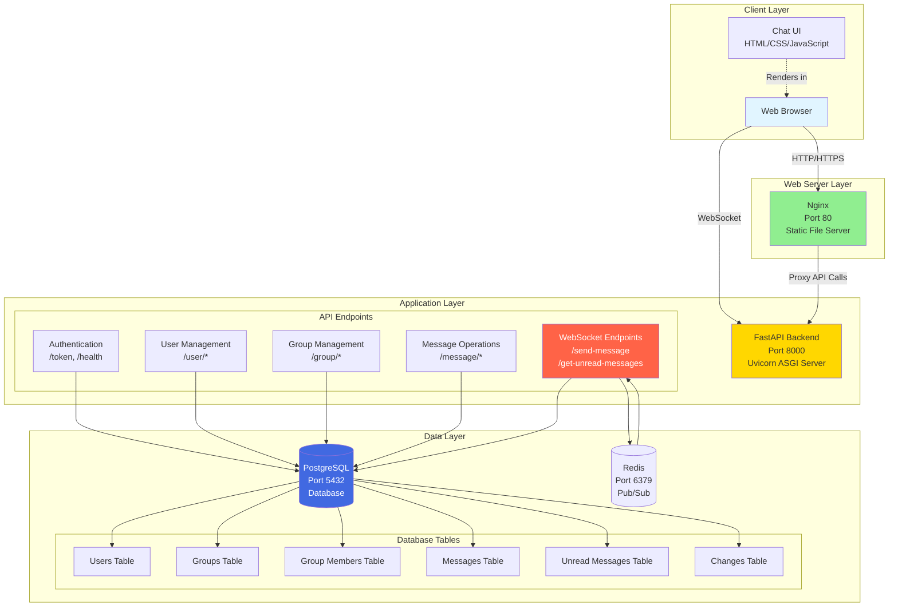

# Chat Application Architecture

## System Overview

This is a real-time WebSocket-based chat application built with a FastAPI backend, PostgreSQL database, Redis pub/sub for cross-instance fan-out, and a vanilla JavaScript frontend served by Nginx.

## Architecture Diagram



## Component Details

### 1. Frontend (Nginx)
- **Technology**: Nginx 1.25.4-alpine
- **Port**: 80
- **Purpose**: Serves static HTML, CSS, JavaScript files
- **Key Pages**:
  - `index.html` - Landing page
  - `login.html` - User login
  - `create_user.html` - User registration
  - `chat.html` - Main chat interface
  - `group_list.js` - Group management

### 2. Backend (FastAPI)
- **Technology**: FastAPI with Uvicorn ASGI server
- **Language**: Python 3.12
- **Port**: 8000
- **Key Features**:
  - RESTful API endpoints
  - WebSocket support for real-time messaging
  - JWT-based authentication
  - Async/await operations
  - Redis pub/sub integration for horizontal scaling

#### API Modules:
- **Authentication** (`auth.py`): JWT token generation, health checks
- **User Management** (`user.py`): User CRUD operations
- **Group Management** (`groups.py`): Create, join, manage groups
- **Messages** (`messages.py`): Message CRUD operations
- **WebSocket** (`websocket.py`): Real-time message sending, receiving, and broadcasting

### 3. Database (PostgreSQL)
- **Technology**: PostgreSQL 16.2-alpine
- **Port**: 5432 (internal)
- **Schema**:
  - **Users**: User accounts with authentication
  - **Groups**: Chat groups/rooms
  - **Group Members**: Many-to-many relationship between users and groups
  - **Messages**: Chat messages with sender, group, timestamp
  - **Unread Messages**: Tracks unread messages per user
  - **Changes**: Tracks edit/delete operations on messages

### 4. Redis Pub/Sub
- **Technology**: Redis 7
- **Port**: 6379 (internal)
- **Purpose**: Broadcast lightweight realtime events between FastAPI replicas
- **Channel Role**:
  - Publish `message` events after unread rows are persisted
  - Publish `change` events for edit/delete operations
  - Wake only the local websocket listeners connected to the relevant group on each replica

## Data Flow

### User Registration & Authentication
```
User → Nginx → FastAPI (/user/create) → PostgreSQL (Users table)
User → Nginx → FastAPI (/token) → JWT Token → User
```

### Real-time Messaging Flow
```
1. User connects via WebSocket with JWT token
2. FastAPI validates token and group membership
3. User sends message → FastAPI → PostgreSQL (Messages table)
4. FastAPI creates unread entries in PostgreSQL
5. FastAPI publishes a Redis event for the target group
6. Every FastAPI replica wakes local WebSocket listeners for that group
7. Each local listener reads unread rows for its user/group and sends them to the browser
```

### Distributed Broadcast Flow
```
1. Replica A accepts the incoming message or edit/delete request
2. Replica A writes the durable state to PostgreSQL
3. Replica A publishes a compact event to Redis
4. Redis forwards that event to all subscribed FastAPI replicas
5. Each replica checks whether it owns websocket listeners for the target group
6. If it does, it pushes the event or unread messages to those local clients
```

### Message Operations
```
- Send: WebSocket /send-message
- Receive: WebSocket /get-unread-messages (real-time updates)
- Edit: Broadcast change event to all group members
- Delete: Broadcast change event to all group members
```

## Communication Protocols

### HTTP/REST API
- User authentication (POST /token)
- User management (CRUD operations)
- Group management (create, join, leave)
- Message history retrieval
- Health checks

### WebSocket
- Real-time message sending
- Real-time message receiving
- Broadcast changes (edit/delete)
- Connection management with per-instance user/group tracking
- Redis-triggered wake-up signals for group listeners

## Security Features

- **JWT Authentication**: Secure token-based auth with expiration
- **Password Hashing**: Bcrypt hashing for user passwords
- **WebSocket Authorization**: Token validation on WebSocket connections
- **Group Membership Validation**: Ensures users can only access authorized groups
- **CORS**: Configured for secure cross-origin requests
- **Distributed Fan-out**: Redis pub/sub keeps edit/delete and new-message delivery in sync across backend replicas

## Deployment Architecture

```
Docker Compose
├── nginx (chat_app-nginx-1)
│   └── Volumes: ./frontend → /usr/share/nginx/html
├── app (chat_app-app-1)
│   └── Depends on: db, redis
├── redis (chat_app-redis-1)
│   └── Pub/Sub channel for realtime fan-out
└── db (chat_app-db-1)
    └── Health checks enabled
```

### Container Dependencies
1. **Database** starts first with health checks
2. **Redis** starts for pub/sub fan-out
3. **Backend** waits for database and connects to Redis on startup
4. **Nginx** starts after backend

## Key Technical Decisions

1. **Async Operations**: Uses Python async/await for non-blocking I/O
2. **WebSocket for Real-time**: Enables instant message delivery without polling
3. **Redis Pub/Sub for Fan-out**: Decouples realtime delivery from any single backend instance
4. **Docker Compose**: Simplified deployment and development setup
5. **PostgreSQL**: Relational database for complex queries and data integrity
6. **JWT Tokens**: Stateless authentication for scalability

## Scalability Considerations

**Current Limitations**:
- Single database instance
- No caching layer
- Group presence is still tracked per app instance, so cross-instance multi-session policies remain simple
- Redis is used for notification fan-out, not as the primary message store

**Future Enhancements**:
- Redis presence tracking for strict global single-session enforcement
- Database replication for read scalability
- Load balancer for multiple backend instances
- Message queue for reliable message delivery
- CDN for static assets

## API Endpoints Summary

| Endpoint | Method | Purpose |
|----------|--------|---------|
| `/health` | GET | Health check |
| `/token` | POST | Generate JWT token |
| `/user/create` | POST | Create new user |
| `/user/{user_id}` | GET | Get user details |
| `/group/create` | POST | Create new group |
| `/group/{group_id}` | GET | Get group details |
| `/message/history` | GET | Get message history |
| `/send-message` | WebSocket | Send real-time messages |
| `/get-unread-messages` | WebSocket | Receive real-time updates |

## Database Schema

```sql
Users
├── id (PK)
├── username (unique)
├── password (hashed)
├── email (unique)
├── display_name
├── role (admin/member)
├── bio
└── profile_pic

Groups
├── id (PK)
├── address (unique)
└── name

GroupMembers
├── id (PK)
├── user_id (FK → Users)
├── group_id (FK → Groups)
└── role

Messages
├── id (PK)
├── text
├── created_at
├── sender_id (FK → Users)
├── sender_name
└── group_id (FK → Groups)

UnreadMessages
├── id (PK)
├── user_id (FK → Users)
├── message_id (FK → Messages)
└── group_id (FK → Groups)
```

## Technology Stack

- **Frontend**: HTML5, CSS3, JavaScript (Vanilla), Bootstrap
- **Backend**: Python 3.12, FastAPI, SQLAlchemy, Uvicorn
- **Database**: PostgreSQL 16.2
- **Pub/Sub**: Redis 7
- **Web Server**: Nginx 1.25.4
- **Authentication**: JWT (JSON Web Tokens)
- **Password Hashing**: Bcrypt
- **Real-time Communication**: WebSocket
- **Containerization**: Docker, Docker Compose

---

**Version**: 1.0  
**Last Updated**: March 2026  
**Author**: [Chai Pin Zheng](https://github.com/chaipinzheng)
