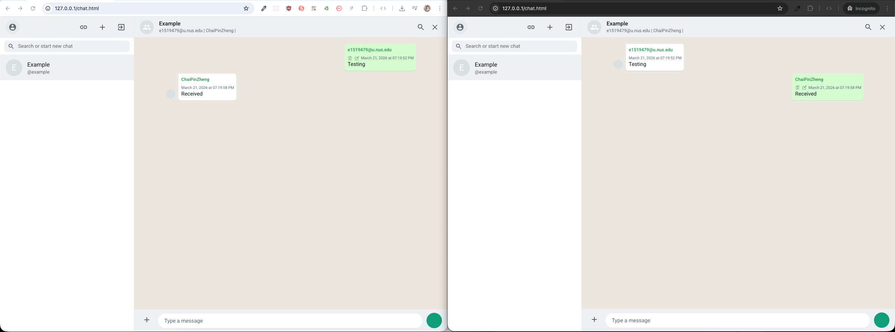
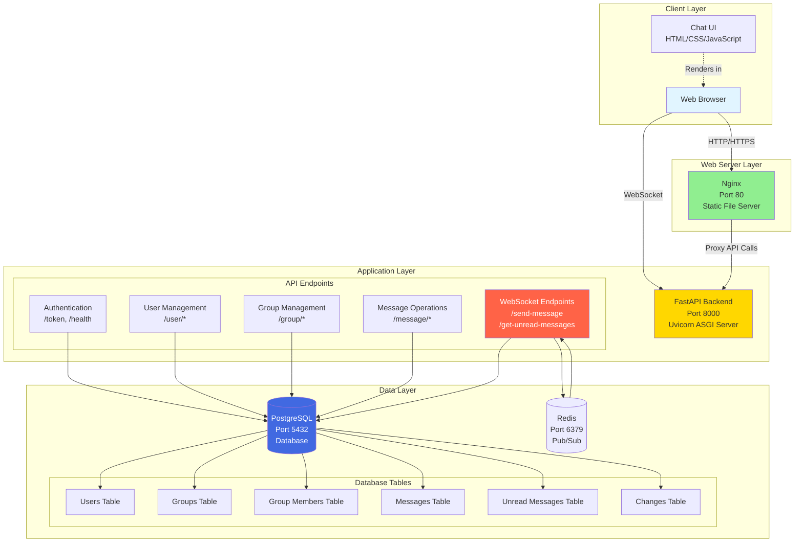
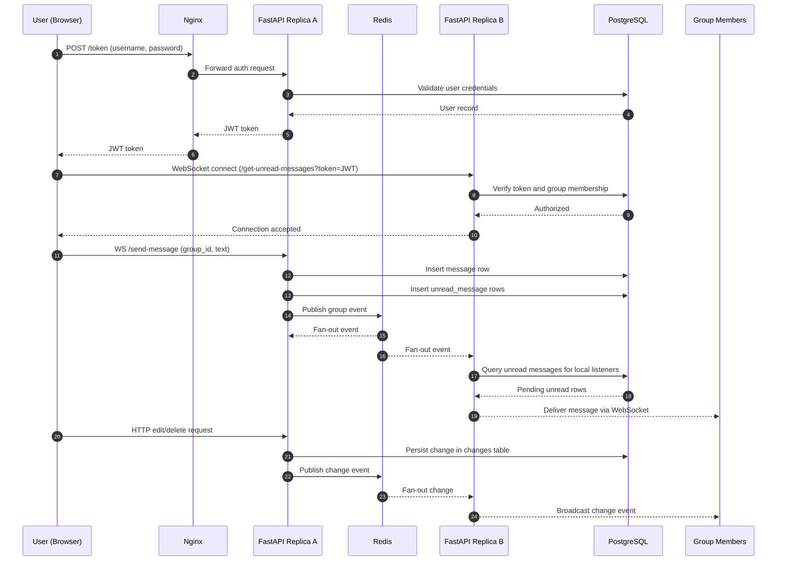

<a name="readme-top"></a>

<br />
<div align="center">
  <h1 align="center">💬 Chat App</h1>

  <p align="center">
    A real-time WebSocket chat application built with FastAPI, PostgreSQL, Redis pub/sub, and vanilla JavaScript.
    <br />
    <a href="ARCHITECTURE.md"><strong>Explore the Architecture »</strong></a>
    <br />
    <br />
    <a href="#getting-started">Quick Start</a>
    ·
    <a href="https://github.com/chaipinzheng/socketio-chat/issues/new?labels=bug">Report Bug</a>
    ·
    <a href="https://github.com/chaipinzheng/socketio-chat/issues/new?labels=enhancement">Request Feature</a>
  </p>
</div>

---

## Table of Contents

- [About The Project](#about-the-project)
  - [Architecture](#architecture)
  - [Sequence Diagram](#sequence-diagram)
  - [Built With](#built-with)
- [Getting Started](#getting-started)
  - [Prerequisites](#prerequisites)
  - [Installation](#installation)
- [Usage](#usage)
  - [Demo](#demo)
- [Roadmap](#roadmap)
- [License](#license)
- [Contact](#contact)

---

## About The Project



A real-time group chat application that lets users send and receive messages instantly without page refreshes. Built using WebSockets at the core, the app supports group creation, live message broadcasting, inline edit/delete operations, and Redis-backed horizontal scaling across backend replicas.

The frontend is intentionally lightweight — raw HTML, CSS, and JavaScript with Bootstrap — keeping things fast and dependency-free.

**Key highlights:**

- 🔒 JWT-based authentication & bcrypt password hashing
- ⚡ Fully async Python backend (FastAPI + Uvicorn)
- 📡 WebSocket connections for real-time updates (send, receive, edit, delete)
- 🔁 Redis pub/sub for cross-instance message fan-out
- 🐳 One-command Docker Compose deployment

<p align="right">(<a href="#readme-top">back to top</a>)</p>

### Architecture



See the full breakdown in [ARCHITECTURE.md](ARCHITECTURE.md).

### Sequence Diagram



### Built With

| Layer | Technology |
|---|---|
| **Frontend** | HTML5, CSS3, JavaScript, Bootstrap |
| **Backend** | Python 3.12, FastAPI, SQLAlchemy, Uvicorn |
| **Database** | PostgreSQL 16.2 |
| **Web Server** | Nginx 1.25.4 |
| **Auth** | JWT, Bcrypt |
| **Infra** | Docker, Docker Compose, Redis |

<p align="right">(<a href="#readme-top">back to top</a>)</p>

---

## Getting Started

### Prerequisites

- [Docker](https://www.docker.com/get-started) and [Docker Compose](https://docs.docker.com/compose/) installed on your machine.

### Installation

1. Clone the repo
   ```bash
   git clone https://github.com/chaipinzheng/socketio-chat
   cd socketio-chat
   ```

2. Start all services with Docker Compose
   ```bash
   docker-compose up -d
   ```

3. Open your browser and navigate to [http://localhost](http://localhost)

That's it — Nginx, FastAPI, PostgreSQL, and Redis all start together automatically.

To run multiple backend replicas with the same Redis pub/sub bus:

```bash
docker compose up -d --build --scale app=3
```

<p align="right">(<a href="#readme-top">back to top</a>)</p>

---

## Usage

### Demo

<div align="center">
  <video src="readme_files/recording.mov" controls width="900"></video>
</div>

If the embedded player does not load on your platform, open the video directly: [Demo recording](readme_files/recording.mov).

### Redis Pub/Sub Flow

Redis pub/sub was added to remove the single-instance websocket bottleneck. Before this change, a message could only be pushed to users connected to the same FastAPI process that created it. Now every backend replica can receive the same group event and notify its own local websocket clients.

The flow now works like this:

1. A client sends a message to `/send-message` on one FastAPI replica.
2. That replica stores the message in PostgreSQL and creates unread rows for the group members.
3. The backend publishes a lightweight event to Redis for the target group.
4. Every FastAPI replica subscribed to the Redis channel receives the event.
5. Each replica wakes only the websocket listeners it owns for that group.
6. Those listeners read unread rows from PostgreSQL and push the message to the browser.
7. Edit and delete actions follow the same pattern, except the Redis payload contains the change details directly.

Here is the core handoff from the websocket layer into Redis-aware fan-out:

```python
async def broadcast_message(group_id: int, message: Message, db) -> None:
    group = await get_group_by_id(db=db, group_id=group_id)
    if group:
        for member in group.members:
            await create_unread_message_controller(
                db=db,
                message=message,
                user=member.user,
                group_id=group_id,
            )
        await realtime.publish_message(group_id)
```

And the Redis listener wakes matching websocket consumers on every app instance:

```python
def _wake_group(self, group_id: int) -> None:
    for connection in self.connections.values():
        if connection.group_id == group_id:
            connection.message_event.set()
```

This keeps PostgreSQL as the durable source of truth for unread delivery, while Redis handles fast cross-instance notification.

### Screenshots

<div align="center">
  
  &nbsp;
  
  &nbsp;
  
</div>

<br/>

**Available REST API endpoints:**


For the full architecture breakdown, see [ARCHITECTURE.md](ARCHITECTURE.md).

<p align="right">(<a href="#readme-top">back to top</a>)</p>

---

## Roadmap

- [ ] Email and username validation
- [ ] Complete Pydantic schemas for all models
- [ ] Improved frontend UI/UX
- [ ] Photo and file sharing
- [ ] Reply-to-message support
- [ ] Redis presence tracking for stricter global session handling
- [ ] Redis caching layer for unread-message lookups

<p align="right">(<a href="#readme-top">back to top</a>)</p>

---

## License

Distributed under the MIT License. See [`LICENSE`](LICENSE) for more information.

<p align="right">(<a href="#readme-top">back to top</a>)</p>

---

## Contact

Chai Pin Zheng — [@chaipinzheng](https://github.com/chaipinzheng)

Project Link: [https://github.com/chaipinzheng/socketio-chat](https://github.com/chaipinzheng/socketio-chat)

<p align="right">(<a href="#readme-top">back to top</a>)</p>
