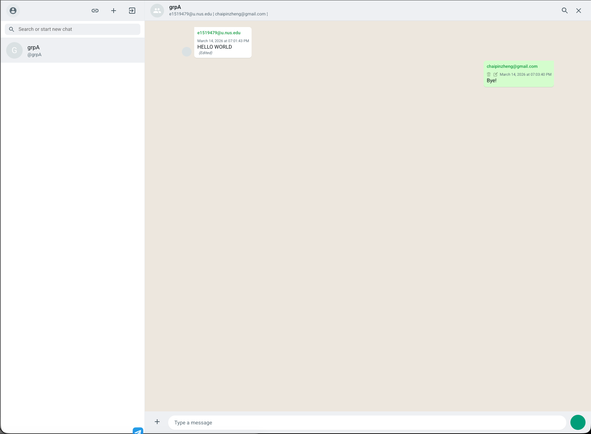
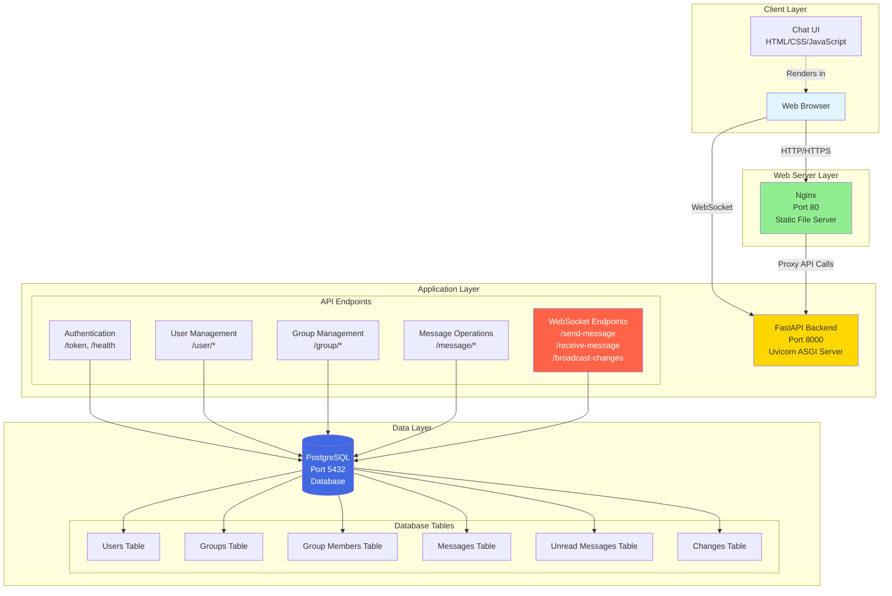
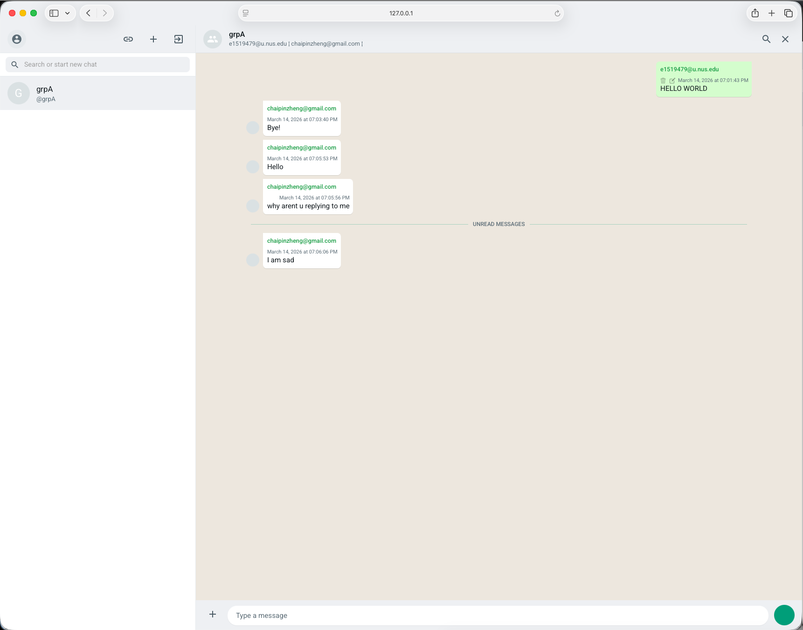
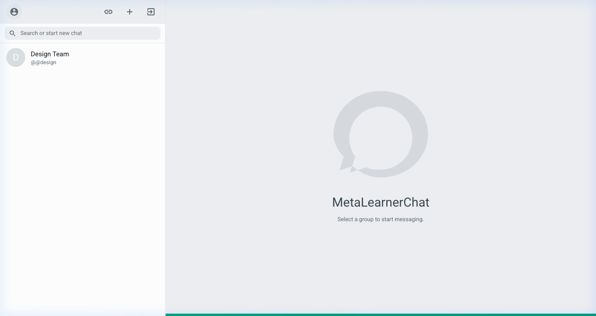
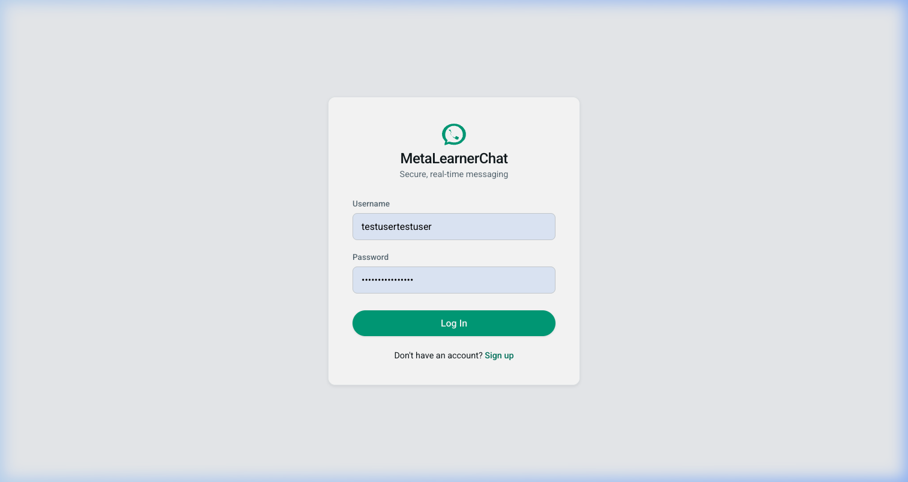
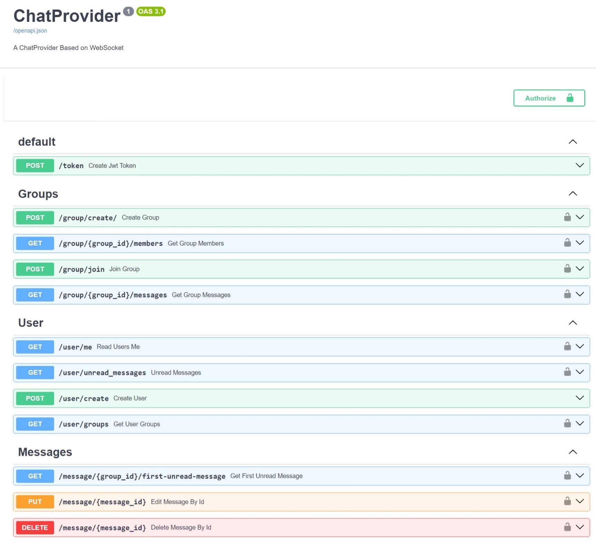

<a name="readme-top"></a>

<br />
<div align="center">
  <h1 align="center">💬 Chat App</h1>

  <p align="center">
    A real-time WebSocket chat application built with FastAPI, PostgreSQL, and vanilla JavaScript.
    <br />
    <a href="ARCHITECTURE.md"><strong>Explore the Architecture »</strong></a>
    <br />
    <br />
    <a href="#getting-started">Quick Start</a>
    ·
    <a href="https://github.com/chaipinzheng/socketio-chat/issues/new?labels=bug">Report Bug</a>
    ·
    <a href="https://github.com/chaipinzheng/socketio-chat/issues/new?labels=enhancement">Request Feature</a>
  </p>
</div>

---

## Table of Contents

- [About The Project](#about-the-project)
  - [Architecture](#architecture)
  - [Built With](#built-with)
- [Getting Started](#getting-started)
  - [Prerequisites](#prerequisites)
  - [Installation](#installation)
- [Usage](#usage)
  - [Demo](#demo)
- [Roadmap](#roadmap)
- [License](#license)
- [Contact](#contact)

---

## About The Project



A real-time group chat application that lets users send and receive messages instantly without page refreshes. Built using WebSockets at the core, the app supports group creation, live message broadcasting, and inline edit/delete operations — all running as three coordinated Docker containers.

The frontend is intentionally lightweight — raw HTML, CSS, and JavaScript with Bootstrap — keeping things fast and dependency-free.

**Key highlights:**

- 🔒 JWT-based authentication & bcrypt password hashing
- ⚡ Fully async Python backend (FastAPI + Uvicorn)
- 📡 WebSocket connections for real-time updates (send, receive, edit, delete)
- 🐳 One-command Docker Compose deployment

<p align="right">(<a href="#readme-top">back to top</a>)</p>

### Architecture



See the full breakdown in [ARCHITECTURE.md](ARCHITECTURE.md).

### Built With

| Layer | Technology |
|---|---|
| **Frontend** | HTML5, CSS3, JavaScript, Bootstrap |
| **Backend** | Python 3.12, FastAPI, SQLAlchemy, Uvicorn |
| **Database** | PostgreSQL 16.2 |
| **Web Server** | Nginx 1.25.4 |
| **Auth** | JWT, Bcrypt |
| **Infra** | Docker, Docker Compose |

<p align="right">(<a href="#readme-top">back to top</a>)</p>

---

## Getting Started

### Prerequisites

- [Docker](https://www.docker.com/get-started) and [Docker Compose](https://docs.docker.com/compose/) installed on your machine.

### Installation

1. Clone the repo
   ```bash
   git clone https://github.com/chaipinzheng/socketio-chat
   cd socketio-chat
   ```

2. Start all services with Docker Compose
   ```bash
   docker-compose up -d
   ```

3. Open your browser and navigate to [http://localhost](http://localhost)

That's it — Nginx, FastAPI, and PostgreSQL all start together automatically.

<p align="right">(<a href="#readme-top">back to top</a>)</p>

---

## Usage

### Demo

<div align="center">
  <video src="readme_files/recording.mov" controls width="900"></video>
</div>

If the embedded player does not load on your platform, open the video directly: [Demo recording](readme_files/recording.mov).

### WebSocket Flow

When a user joins a group, the app opens a WebSocket connection. Any message sent is broadcast in real time to all online members. Offline members receive unread counts on their next login.

Here's how change broadcasts are handled internally (shortened — see full code in [`websocket.py`](backend/chat/views/websocket.py)):

```python
async def broadcast_changes(
    group_id: int,
    message_id: int,
    new_text: str | None = None,
    change_type: models.ChangeType,
    db: Session,
) -> None:
    ...
    online_users = set(websocket_connections.keys())
    await asyncio.gather(
        *[
            send_change_to_user(
                member.user.id, changed_value, online_users=online_users
            )
            for member in group.members
        ]
    )
```

### Screenshots

<div align="center">
  
  &nbsp;
  
  &nbsp;
  
</div>

<br/>

**Available REST API endpoints:**



For the full architecture breakdown, see [ARCHITECTURE.md](ARCHITECTURE.md).

<p align="right">(<a href="#readme-top">back to top</a>)</p>

---

## Roadmap

- [ ] Email and username validation
- [ ] Complete Pydantic schemas for all models
- [ ] Improved frontend UI/UX
- [ ] Photo and file sharing
- [ ] Reply-to-message support
- [ ] Redis caching layer for unread messages and session management

<p align="right">(<a href="#readme-top">back to top</a>)</p>

---

## License

Distributed under the MIT License. See [`LICENSE`](LICENSE) for more information.

<p align="right">(<a href="#readme-top">back to top</a>)</p>

---

## Contact

Chai Pin Zheng — [@chaipinzheng](https://github.com/chaipinzheng)

Project Link: [https://github.com/chaipinzheng/socketio-chat](https://github.com/chaipinzheng/socketio-chat)

<p align="right">(<a href="#readme-top">back to top</a>)</p>
